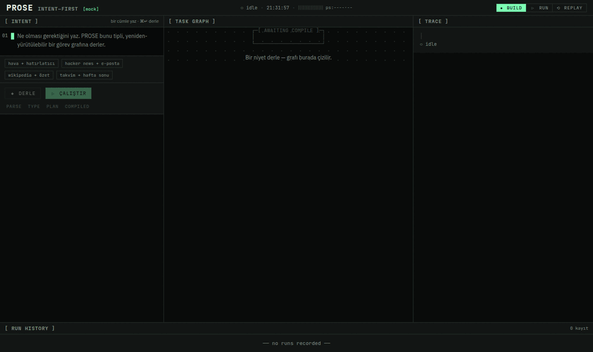
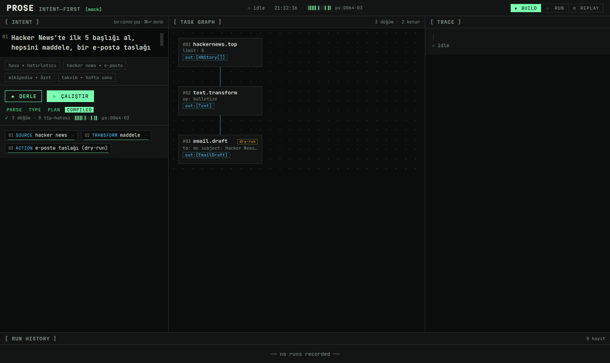
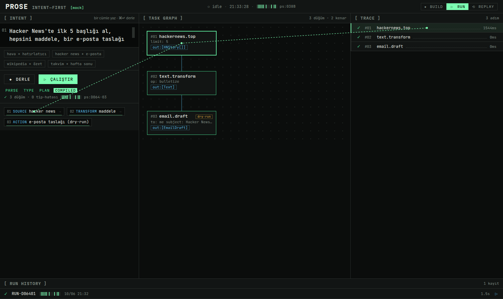
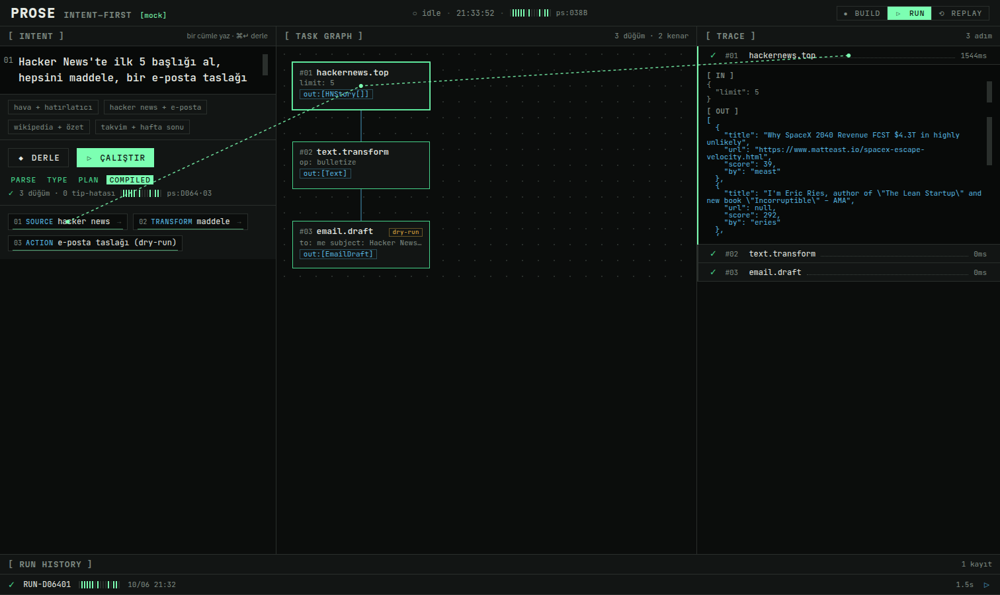
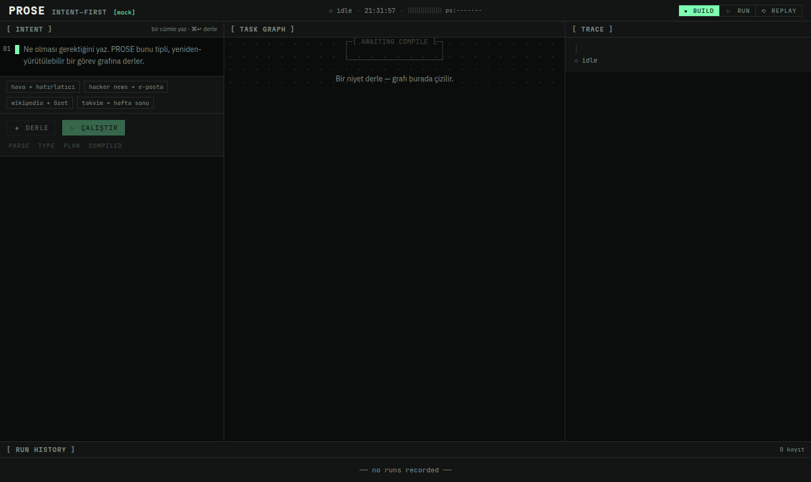

# PROSE — Intent-First Programming

> **A sentence is source code.** PROSE compiles one natural-language intent into a
> **typed, versioned, replayable** agent task-graph, then executes it step-by-step with a
> verification layer, automatic retries, idempotency, and a live observability trace.

[](https://vercel.com/new/clone?repository-url=https://github.com/iWeslax83/prose)



Think *SQL for general computation, but for agents*. You write what should happen; PROSE
plans it, types it, runs it, verifies it, and lets you replay it deterministically.

|  |  |
|---|---|
|  |  |
| **Compile** — a sentence becomes a typed graph (parse strip, schema chips, checksum tape). | **The Living Seam** — hover a node to stitch its intent clause → graph node → trace row. |
|  |  |
| **Execute** — live trace with real tool I/O (here: actual Hacker News data) + durations. | **The instrument** — dark phosphor terminal, status-as-typography, zero decoration. |

```
"Hacker News'te ilk 5 başlığı al, hepsini maddele, bir e-posta taslağı yap."
        │ compile
        ▼
  #01 hackernews.top  ──►  #02 text.transform  ──►  #03 email.draft (dry-run)
     out:[HNStory[]]          out:[Text]              out:[EmailDraft]
        │ execute (live trace, retries, verify gates, idempotency)
        ▼
  ✓ #01 hackernews.top ···· 1721ms     run RUN-D06401 · ps:D064·03 · deterministic ✓
  ✓ #02 text.transform ···· 1ms
  ✓ #03 email.draft ······· 0ms
```

---

## Why it's interesting (engineering)

- **Structured-output compilation** — natural language → a Zod-typed `TaskGraph` (nodes,
  edges, branch predicates, verify gates). The LLM only emits a step list; the engine owns
  ids, edges, typing, and the checksum, so a sloppy model can't produce an invalid graph.
- **Deterministic execution & replay** — every plan is content-addressed (`ps:7F3A·22`).
  A run records its tool outputs in a manifest; replaying feeds them back so the run
  reproduces byte-for-byte. The re-derived checksum proves it (cyan = match, red = drift).
- **A real agent runtime** — topological scheduling, branch gating, idempotency keys,
  retries with backoff, and post-condition verify gates — streamed to the UI over SSE.
- **Works with zero API keys** — a deterministic mock compiler ships in the box, so the
  deployed app is fully functional out of the box. Add a key to unlock open-ended intents.

## Tools (all free, no API key)

Real, no-key data sources plus explicit **dry-run** side-effects (nothing is ever sent):

| tool.method | source |
|---|---|
| `weather.current` / `weather.forecast` | open-meteo.com |
| `wikipedia.summary` | Wikipedia REST |
| `hackernews.top` | HN Firebase API |
| `http.get` | any public URL |
| `datetime.now` / `datetime.add`, `math.eval`, `text.transform` | local / pure |
| `email.draft`, `calendar.reminder` | **dry-run** (recorded, never sent) |

## LLM provider (optional)

The app runs key-free on the built-in **mock** compiler. To compile open-ended intents with
an LLM, set environment variables (see `.env.example`):

```bash
PROSE_PROVIDER=groq          # mock | groq | openrouter | ollama | gemini
GROQ_API_KEY=...             # or OPENROUTER_API_KEY / GEMINI_API_KEY (ollama needs none)
# PROSE_MODEL=llama-3.3-70b-versatile   # optional override
```

If a provider is selected but its key is missing, PROSE transparently falls back to the mock
compiler — a fresh deploy with no env vars still works.

## Design — "The Living Seam"

A disciplined terminal instrument (not a landing page): dark phosphor-glass, monospace
structure, hard 1px rules, status-as-typography. The signature detail is the **Living Seam** —
one continuous mint line that physically stitches each *intent clause* → its compiled *graph
node* → its *trace row*; hover any node to see the same English clause light up across all
three surfaces. Full system in [`docs/DESIGN.md`](docs/DESIGN.md); architecture in
[`docs/ARCHITECTURE.md`](docs/ARCHITECTURE.md).

Type system: JetBrains Mono (machine) · Martian Mono (`[LABELS]`) · IBM Plex Sans (prose).

## Run locally

```bash
npm install
npm run dev          # http://localhost:3000
# or a production build
npm run build && npm start
```

Open the app, click a showcase intent, press **DERLE** (compile), then **ÇALIŞTIR** (run).

## Stack

Next.js 16 (App Router) · TypeScript · Zod · ELK.js (orthogonal graph layout) · SSE streaming.
No database — run manifests persist in `localStorage` and are the replay source of truth.

## Deploy

One click with the button above, or `vercel`. No environment variables are required for the
key-free demo.

---

Built for the TREX 2026 AI hackathon. © Emir Sakarya ([@iWeslax83](https://github.com/iWeslax83)).
